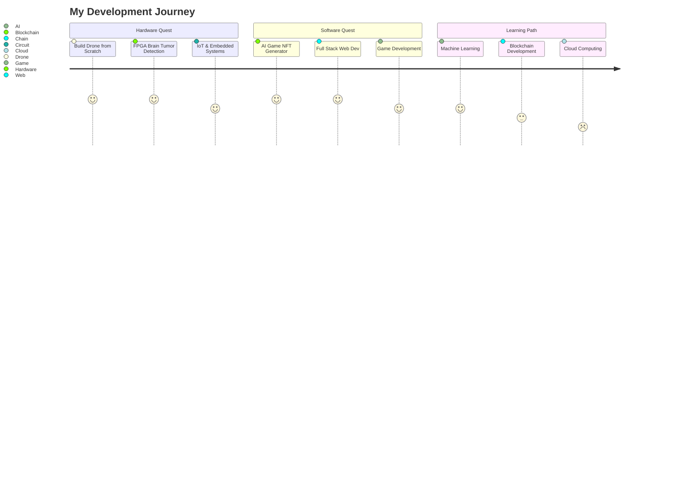

<div align="center">
  


</div>

<div align="center">
  
```ascii
    ╔══════════════════════════════════════════════════════════╗
    ║                    PLAYER PROFILE                        ║
    ║                                                          ║
    ║  Name: Rishikesh Paudel                   Level: ∞      ║
    ║  Class: Full-Stack Engineer / Drone Pilot               ║
    ║  Location: Kathmandu, Nepal 🇳🇵                          ║
    ║  Guild: IOE, Pulchowk Campus                            ║
    ╚══════════════════════════════════════════════════════════╝
```


</div>

---

## 🎮 Main Menu

<div align="center">

[](https://git.io/typing-svg)

</div>

---

## 🗺️ Quest Map

<div align="center">



</div>

---

## ⚔️ Skills & Equipment

<div align="center">

### 🎯 Primary Weapons


### 🛡️ Special Abilities


### 💎 Rare Items


</div>

---

## 🏰 Featured Quests (Projects)

<table align="center">
<tr>
<td width="50%">

### 🎮 Quest: AI Game NFT Generator
```diff
+ Status: COMPLETED
+ Difficulty: ★★★★★
+ XP Gained: 5000
```
**Rewards Unlocked:**
- 🏆 Sui Blockchain Mastery
- ⚡ API Integration Skills
- 🎨 Creative AI Powers

[🎮 Play](link) | [📜 Code](link) | [🔗 Contract](link)

</td>
<td width="50%">

### 🚁 Quest: UAV Rooftop Mapper
```diff
+ Status: COMPLETED
+ Difficulty: ★★★★☆
+ XP Gained: 4500
```
**Rewards Unlocked:**
- 🛠️ Hardware Crafting
- 🧠 ML Model Training
- 📍 GIS Expertise

[👁️ Demo](link) | [📦 GitHub](link)

</td>
</tr>
<tr>
<td width="50%">

### 🏛️ Quest: Beneath Mohenjodaro
```diff
+ Status: COMPLETED
+ Difficulty: ★★★☆☆
+ XP Gained: 3000
```
**Rewards Unlocked:**
- 🎯 Game Design Skills
- 📊 Algorithm Visualization
- 🎮 PhaserJS Proficiency

[🕹️ Play Now](link) | [💻 Source](link)

</td>
<td width="50%">

### 🌐 Quest: Leo Club Website
```diff
+ Status: COMPLETED
+ Difficulty: ★★★☆☆
+ XP Gained: 2500
```
**Rewards Unlocked:**
- 🎨 Full Stack Powers
- 👥 User Management
- 📝 CMS Development

[🌍 Visit](link) | [🔧 Code](link)

</td>
</tr>
</table>

---

## 🏆 Achievement Gallery

<div align="center">

| 🥇 Legendary | 🥈 Epic | 🥉 Rare |
|:---:|:---:|:---:|
|  |  |  |
| Brain Tumor Detection | Climate Story Teller | Virtual Psychologist |

</div>

---

## 📊 Player Stats

<div align="center">
  


### 🎯 Current Mission Progress

```text
2025 Goals Progress 
█████████████████░░░░░░░░ 68.42% 
```

</div>

---

## 🎪 Mini-Games

<div align="center">

### 🎹 Piano Mode
```python
class MusicMode:
    def __init__(self):
        self.instrument = "🎹 Piano"
        self.skill_level = "Advanced"
        self.platforms = ["YouTube", "Instagram"]
    
    def play_melody(self):
        return "♪ ♫ ♬ Creating beautiful melodies... ♬ ♫ ♪"
```

### 📸 Photography Mode
```javascript
const photographyMode = {
    camera: "📷",
    specialty: ["Landscape", "Portrait"],
    portfolio: "@instagram",
    captureBeauty: () => "Freezing moments in time... 📸✨"
};
```

</div>

---

## 🌟 Power-Ups & Buffs

<div align="center">

| Buff | Status | Duration |
|:---:|:---:|:---:|
| ☕ Coffee | ACTIVE | ∞ |
| 🎵 Music | ACTIVE | While Coding |
| 🚁 Drone Vision | READY | On Demand |
| 🧠 Problem Solving | PASSIVE | Always On |

</div>

---

## 💬 NPC Dialogue

<div align="center">

```
┌─────────────────────────────────────────────────┐
│ Visitor: "Hey! What are you working on?"        │
│                                                 │
│ Rishikesh: ▶ Building cool stuff with drones   │
│           ▶ Creating AI-powered games           │
│           ▶ Solving real-world problems         │
│           ▶ [Join my party!] 🎮                │
└─────────────────────────────────────────────────┘
```

</div>

---

## 🎮 Multiplayer Mode (Connect)

<div align="center">

[](mailto:rishikesh0523@gmail.com)
[](https://github.com/rishikesh0523)
[](https://yourwebsite.com)

### 🎯 Side Quests Available

```diff
! Looking for collaboration on innovative projects
! Open to hackathon team-ups
! Available for freelance adventures
```

</div>

---

<div align="center">

### 🕹️ Game Controls

`↑` Scroll Up `↓` Scroll Down `ENTER` Select Project `ESC` Exit

---


```ascii
╔════════════════════════════════════════╗
║  Thanks for playing! Come back soon!   ║
║         GAME OVER... NOT! 🎮           ║
╚════════════════════════════════════════╝
```


</div>
```
